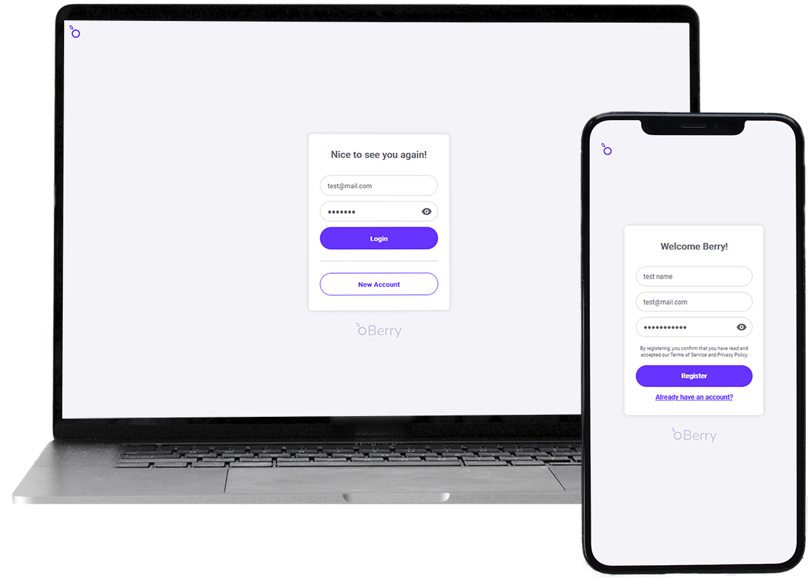

# 📋 Berry App 🍇🍒  
Berry is an app of the MEAN Stack tack.
starting from the idea of the to do list I wanted to apply it to the scrum style, inspired by trello and jira.  
The functionality is a crud of projects, categories and tasks, which can have objectives and tags.  
➜ Demo:
[Landing Page](https://berryweb.netlify.app/home)  
[App](https://berry-app.netlify.app/user/login)  


---
➜ [Design in progress in Figma](https://www.figma.com/file/2hSVjy3OUFsHX7uPmyyXDn/Berry)

---




---  

## 📂  What do you need to have installed on your computer?

➜ Node [LTS Version](https://nodejs.org/en/)  
➜ Angular: npm install -g @angular/cli

---
### 📚  This project use:

## FRONTEND  
I have developed the frontend with [Angular](https://angular.io/) v14   

➜  Lazy loading modules  
➜  RxJS   
➜  Models/Interfaces
➜  Pipes  

➜  [Drag Scroll library](https://www.npmjs.com/package/ngx-drag-scroll)  
  
➜ [FrontEnd Repo](https://github.com/abigailojeda/berryApp)

## BACKEND
For this project I have built an API node, using [Express](https://expressjs.com/es/4x/api.html) for requests,  
[Mongoose](https://mongoosejs.com/) to connect to mongo database, [bcryptjs](https://www.npmjs.com/package/bcryptjs) and and for authentication [jsonwebtoken](https://www.npmjs.com/package/jsonwebtoken)  


## BONUS
I have also created a landing page in whose development I enjoyed with the [AOS](https://michalsnik.github.io/aos/) on scroll animation library  

➜ [Landing Page Repo](https://github.com/abigailojeda/berryWeb)

---

#### 👨‍🚀 check POSTMAN endpoints 

[Run in Postman](https://documenter.getpostman.com/view/18449118/2s8ZDSckcq)  
  
IMPORTANT:  
This app use authentification, so you need a token to try this endpoints.  
To get the token, you only need to:  
- Run app  
- Create an user or Login
- Check localstorage, and there you will find the token  


## ⚙️ Project Settings

### backend
To test the backend locally:  

➜ npm install

IMPORTANT:
First, create a database in [MongoDB Atlas](https://www.mongodb.com/cloud/atlas) and establish the connection in [MongoDBCompass](https://www.mongodb.com/products/compass)  

You need to create a .env file for configuration:
```javascript
PORT = yourLocalPort
SECRET_JWT_SEED=aSecretYouDecideToWrite
BD_CNN=mongodb+srv://yourUriOnMongoDBCompass:

```


### frontend
In the frontend folder( cd frontend),  install the dependencies:
➜ npm install


## 🔎 what will you find in Berry app?  

### ➜ Create & Delete Project


### ➜ Create & Delete Categories  


### ➜ Create, Update & Delete Tasks  


---
 🙋🏻‍♀️ [Abigail Ojeda Alonso](https://es.linkedin.com/in/abigail-ojeda)

